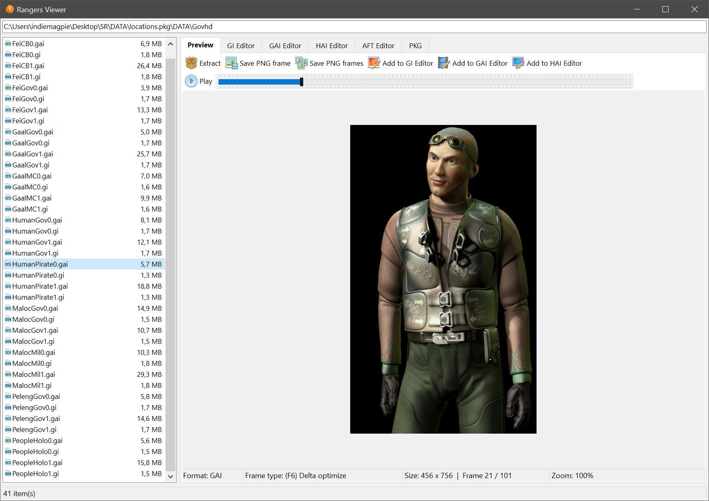

#  RangersViewer

Game resource viewer/editor for [Space Rangers HD](https://store.steampowered.com/app/214730/Space_Rangers_HD_A_War_Apart/).

## Current features

* View and create game archives in PKG format
* View and create game graphics in GI format
* View and create game animations in GAI format
* View and create game animations in HAI format
* View and create game fonts in AFT format
* Play music DAT files
* Full support for all GI format frame types
* Full support for GAI delta animation
* Arbitrary sizes for HAI format
* Uses the game's own OKGF.dll for accurate color palettes
* Dithering support for GI and GAI formats
* HAI animation preview based on the game's software renderer

## Credits

* File icons taken from SR ResEditor by Koc
* Music playback uses the BASS audio library by Un4seen Developments
